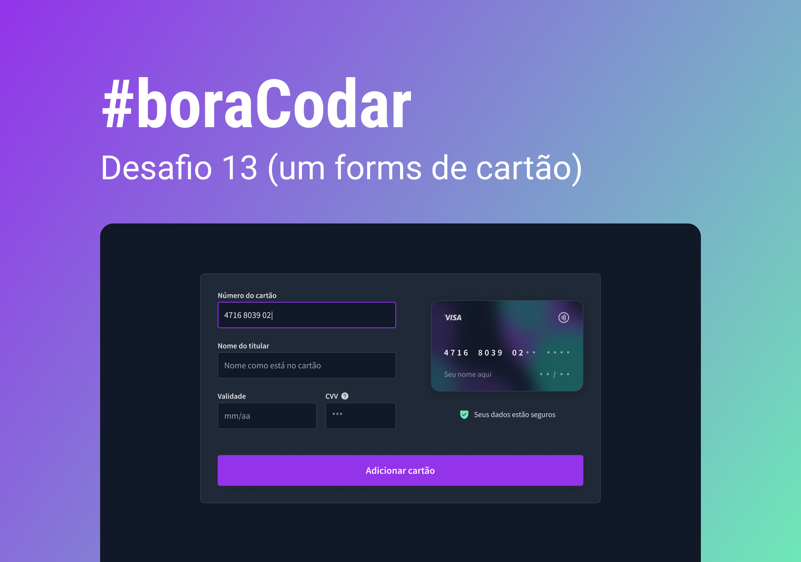

<!-- markdownlint-disable MD033 -->
<!-- markdownlint-disable MD012 -->

# #boraCodar - Desafios RocketSeat

    Projetos #boraCodar da idealizados pela Rocketseat  
    <a href="https://boracodar.dev">Acesse o desafio desta semana clicando aqui</a> 
     <table>
    <thead>
        <tr>
            <th align="center">
                
                

                    <small>#</small>
                

            </th>
            <th align="center">
                
                

                    <small>
                        PROJETO
                    </small>
                

            </th>
            <th align="center">
                
                

                    <small>
                    PREVIEW
                    </small>
                

            </th>
        </tr>
    </thead>
    <tbody>
        <tr>
            <td>01</td>
            <td><a href="01">Music Player </a></td>
            <td align="center">
            </td>
        </tr>
        <tr>
            <td>02</td>
            <td><a href="02">Product Card</a></td>
            <td align="center"></td>
        </tr>
        <tr>
            <td>03</td>
            <td><a href="03">Botões e Cursores</a></td>
            <td align="center"></td>
        </tr>
        <tr>
            <td>04</td>
            <td><a href="04">Chat</a></td>
            <td align="center"></td>
        </tr>
        <tr>
            <td>05</td>
            <td><a href="05">Calculadora</a></td>
            <td align="center"></td>
        </tr>
        <tr>
            <td>06</td>
            <td><a href="06">Cartão de embarque</a></td>
            <td align="center" ></td>
        </tr>
        <tr>
            <td>07</td>
            <td><a href="07">Site para encontrar seu bloco no carnaval</a></td>
            <td align="center" ></td>
        </tr>
        <tr>
            <td>08</td>
            <td><a href="08">Dashboard</a></td>
            <td align="center" ></td>
        </tr>
        <tr>
            <td>09</td>
            <td><a href="09">Conversor de moedas</a></td>
            <td align="center" ></td>
        </tr>
        <tr>
            <td>10</td>
            <td><a href="10">Uma página de clima</a></td>
            <td align="center" ></td>
        </tr>
        <tr>
            <td>11</td>
            <td><a href="11">Uma página de login</a></td>
            <td align="center" ></td>
        </tr>
        <tr>
            <td>12</td>
            <td><a href="12">Um Kanban</a></td>
            <td align="center" ></td>
        </tr>
        <tr>
            <td>13</td>
            <td><a href="13">Um formulário de cartão</a></td>
            <td align="center" ></td>
        </tr>
    </tbody>
</table>

