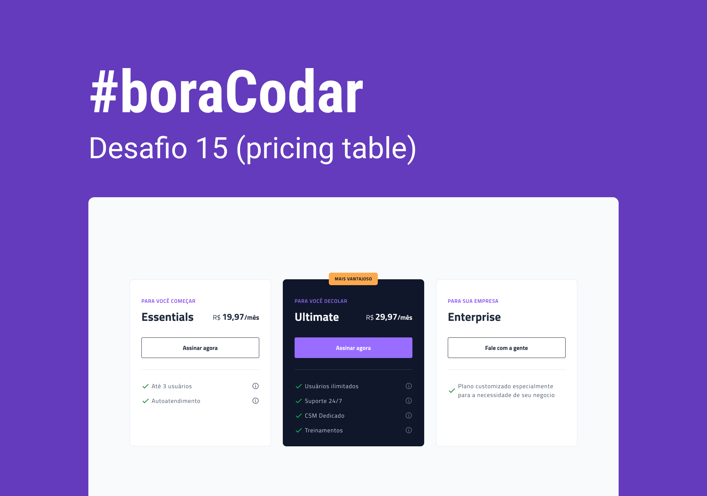

<!-- markdownlint-disable MD033 -->

# `#boraCodar` - Desafios RocketSeat

Todos os desafios listados foram idealizados pela Rocketseat Education. Os projetos foram desenvolvidos por mim através dos modelos preconcebidos na imagem de preview.

Para conhecer ou consultar a resolução dos desafios, acesse <https://boracodar.dev>.

     <table>
    <thead>
        <tr>
            <th align="center">
                
                

                    <code>#</code>
                

            </th>
            <th align="center">
                
                

                    <small>
                        <code>projeto</code>
                    </small>
                

            </th>
            <th align="center">
                
                

                    <small>
                    <code>preview</code>
                    </small>
                

            </th>
            <th align="center">
                
                

                    <small>
                    <code>deploy</code>
                    </small>
                

            </th>
        </tr>
    </thead>
    <tbody>
        <tr>
            <td><code>01</code></td>
            <td><a href="https://github.com/mgckaled/boracodar_desafios-rs/tree/main/d01"><code>music player</code></a></td>
            <td align="center">
            </td>
            <td align="center"></td>
        </tr>
        <tr>
            <td><code>02</code></td>
            <td><a href="https://github.com/mgckaled/boracodar_desafios-rs/tree/main/d02"><code>product card</code></a></td>
            <td align="center"></td>
        </tr>
        <tr>
            <td><code>03</code></td>
            <td><a href="https://github.com/mgckaled/boracodar_desafios-rs/tree/main/d03"><code>botões e cursores</code></a></td>
            <td align="center"></td>
        </tr>
        <tr>
            <td><code>04</code></td>
            <td><a href="https://github.com/mgckaled/boracodar_desafios-rs/tree/main/d04"><code>chat</code></a></td>
            <td align="center"></td>
        </tr>
        <tr>
            <td><code>05</code></td>
            <td><a href="https://github.com/mgckaled/boracodar_desafios-rs/tree/main/d05"><code>calculadora</code></a></td>
            <td align="center"></td>
        </tr>
        <tr>
            <td><code>06</code></td>
            <td><a href="https://github.com/mgckaled/boracodar_desafios-rs/tree/main/d06"><code>calculadora</code></a></td>
            <td align="center" ></td>
        </tr>
        <tr>
            <td><code>07</code></td>
            <td><a href="https://github.com/mgckaled/boracodar_desafios-rs/tree/main/d07"><code>site de busca de bloco de carnaval</code></a></td>
            <td align="center" ></td>
        </tr>
        <tr>
            <td><code>08</code></td>
            <td><a href="https://github.com/mgckaled/boracodar_desafios-rs/tree/main/d08"><code>dashboard</code></a></td>
            <td align="center" ></td>
        </tr>
        <tr>
            <td><code>09</code></td>
            <td><a href="https://github.com/mgckaled/boracodar_desafios-rs/tree/main/d09"><code>conversor de moedas</code></a></td>
            <td align="center" ></td>
        </tr>
        <tr>
            <td><code>10</code></td>
            <td><a href="https://github.com/mgckaled/boracodar_desafios-rs/tree/main/d10"><code>clima-tempo</code></a></td>
            <td align="center" ></td>
        </tr>
        <tr>
            <td><code>11</code></td>
            <td><a href="https://github.com/mgckaled/boracodar_desafios-rs/tree/main/d11"><code>página de login</code></a></td>
            <td align="center" ></td>
        </tr>
        <tr>
            <td><code>12</code></td>
            <td><a href="https://github.com/mgckaled/boracodar_desafios-rs/tree/main/d12"><code>kanban</code></a></td>
            <td align="center" ></td>
        </tr>
        <tr>
            <td><code>13</code></td>
            <td><a href="https://github.com/mgckaled/boracodar_desafios-rs/tree/main/d13"><code>formulário de cartão de crédito</code></a></td>
            <td align="center" ></td>
        </tr>
         <tr>
            <td><code>14</code></td>
            <td><a href="https://github.com/mgckaled/boracodar_desafios-rs/tree/main/d14"><code>componente de upload</code></a></td>
            <td align="center" ></td>
        </tr>
         <tr>
            <td><code>15</code></td>
            <td><a href="https://github.com/mgckaled/boracodar_desafios-rs/tree/main/d15"><code>pricing table</code></a></td>
            <td align="center" ></td>
            <td></td>
        </tr>
    </tbody>
</table>

