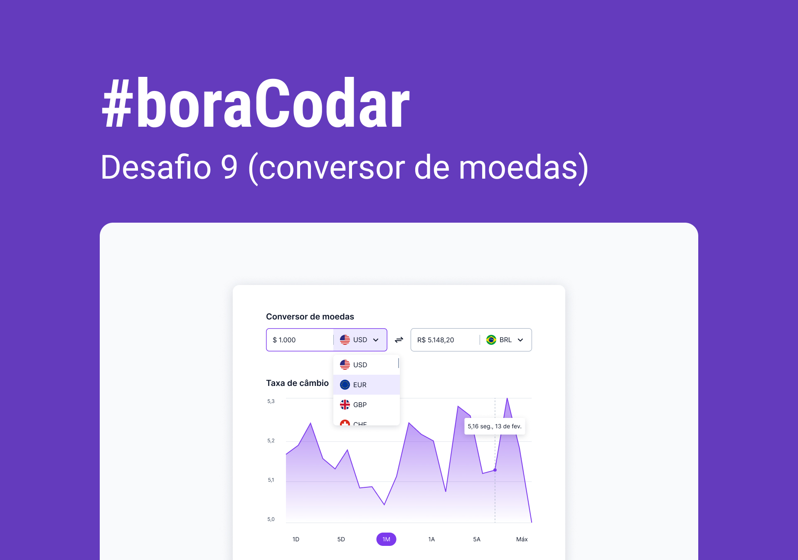
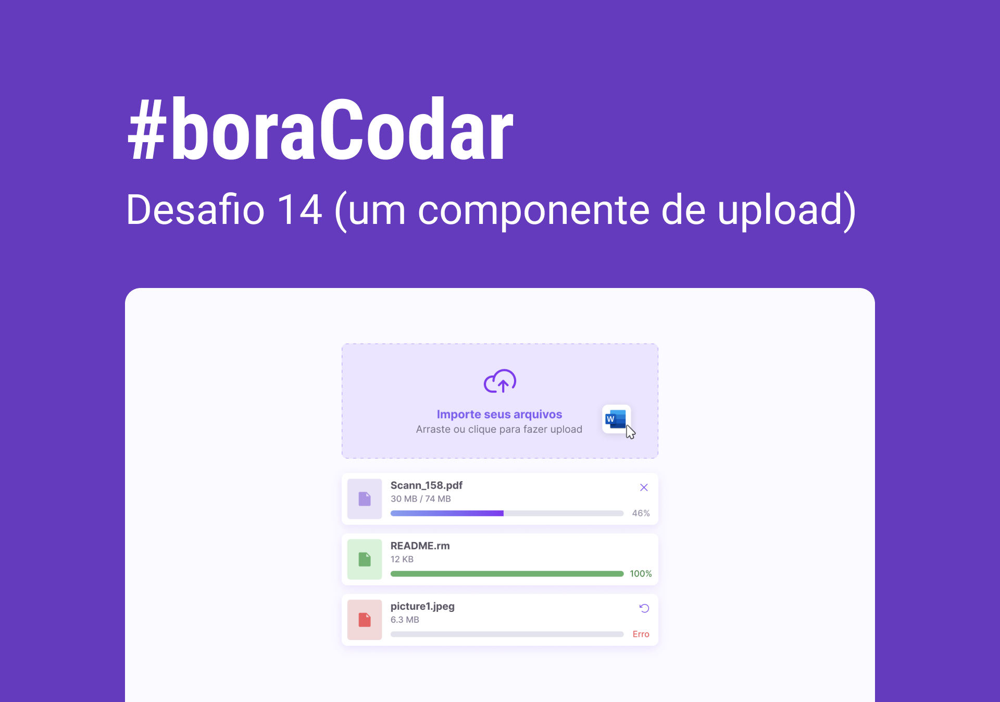
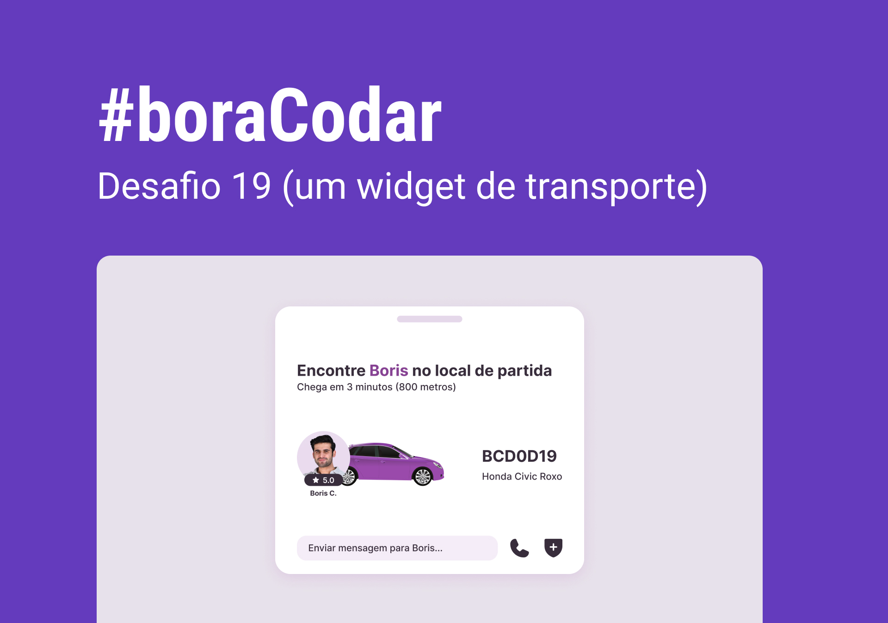
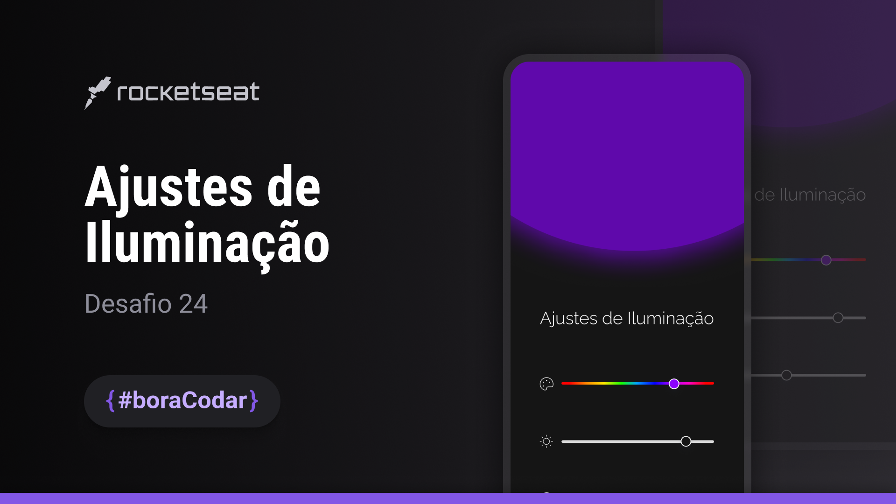

<!-- markdownlint-disable MD033 -->

# `#boraCodar` - Desafios RocketSeat

Todos os desafios listados foram idealizados pela Rocketseat Education. Os projetos foram desenvolvidos por mim através dos modelos preconcebidos na imagem de preview.

Para conhecer ou consultar a resolução dos desafios, acesse <https://boracodar.dev>.

   
  <table>
    <thead>
      <tr>
        <th align="center">
          
          

            <code>#</code>
          

        </th>
        <th align="center">
          
          

            <code>projeto</code>
          

        </th>
        <th align="center">
          
          

            <code>preview</code>
          

        </th>
        <th align="center">
            
            

              <code>deploy</code>
            

        </th>
      </tr>
    </thead>
    <tbody>
        <tr>
          <td><code>01</code></td>
          <td><a href="https://github.com/mgckaled/boracodar_desafios-rs/tree/main/d01" target="_blank" ><code>music player</code></a></td>
          <td align="center">
          </td>
          <td align="center"></td>
        </tr>
        <tr>
          <td><code>02</code></td>
          <td><a href="https://github.com/mgckaled/boracodar_desafios-rs/tree/main/d02" target="_blank" ><code>product card</code></a></td>
          <td align="center"></td>
          <td></td>
        </tr>
        <tr>
          <td><code>03</code></td>
          <td><a href="https://github.com/mgckaled/boracodar_desafios-rs/tree/main/d03" target="_blank" ><code>botões e cursores</code></a></td>
          <td align="center"></td>
          <td align="center"></td>
        </tr>
        <tr>
          <td><code>04</code></td>
          <td><a href="https://github.com/mgckaled/boracodar_desafios-rs/tree/main/d04" target="_blank" ><code>chat</code></a></td>
          <td align="center"></td>
          <td></td>
        </tr>
        <tr>
          <td><code>05</code></td>
          <td><a href="https://github.com/mgckaled/boracodar_desafios-rs/tree/main/d05" target="_blank" ><code>calculadora</code></a></td>
          <td align="center"></td>
          <td></td>
        </tr>
        <tr>
          <td><code>06</code></td>
          <td><a href="https://github.com/mgckaled/boracodar_desafios-rs/tree/main/d06" target="_blank" ><code>cartão de embarque</code></a></td>
          <td align="center" ></td>
          <td></td>
        </tr>
        <tr>
          <td><code>07</code></td>
          <td><a href="https://github.com/mgckaled/boracodar_desafios-rs/tree/main/d07" target="_blank" ><code>site de busca de bloco de carnaval</code></a></td>
          <td align="center" ></td>
          <td></td>
        </tr>
        <tr>
          <td><code>08</code></td>
          <td><a href="https://github.com/mgckaled/boracodar_desafios-rs/tree/main/d08" target="_blank" ><code>dashboard</code></a></td>
          <td align="center" ></td>
          <td></td>
        </tr>
        <tr>
          <td><code>09</code></td>
          <td><a href="https://github.com/mgckaled/boracodar_desafios-rs/tree/main/d09" target="_blank" ><code>conversor de moedas</code></a></td>
          <td align="center" ></td>
          <td></td>
        </tr>
        <tr>
          <td><code>10</code></td>
          <td><a href="https://github.com/mgckaled/boracodar_desafios-rs/tree/main/d10" target="_blank" ><code>clima-tempo</code></a></td>
          <td align="center" ></td>
          <td></td>
        </tr>
        <tr>
          <td><code>11</code></td>
          <td><a href="https://github.com/mgckaled/boracodar_desafios-rs/tree/main/d11" target="_blank" ><code>página de login</code></a></td>
          <td align="center" ></td>
          <td></td>
        </tr>
        <tr>
          <td><code>12</code></td>
          <td><a href="https://github.com/mgckaled/boracodar_desafios-rs/tree/main/d12" target="_blank" ><code>kanban</code></a></td>
          <td align="center" ></td>
          <td></td>
        </tr>
        <tr>
          <td><code>13</code></td>
          <td><a href="https://github.com/mgckaled/boracodar_desafios-rs/tree/main/d13" target="_blank" ><code>formulário de cartão de crédito</code></a></td>
          <td align="center" ></td>
            <td></td>
        </tr>
          <tr>
            <td><code>14</code></td>
            <td><a href="https://github.com/mgckaled/boracodar_desafios-rs/tree/main/d14" target="_blank" ><code>componente de upload</code></a></td>
            <td align="center" ></td>
            <td></td>
        </tr>
          <tr>
            <td><code>15</code></td>
            <td><a href="https://github.com/mgckaled/boracodar_desafios-rs/tree/main/d15" target="_blank" ><code>pricing table</code></a></td>
            <td align="center" ></td>
            <td></td>
        </tr>
        <tr>
            <td><code>16</code></td>
            <td><a href="https://github.com/mgckaled/boracodar_desafios-rs/tree/main/d16" target="_blank" ><code>página de contatos</code></a></td>
            <td align="center" ></td>
            <td></td>
        </tr>
        <tr>
            <td><code>17</code></td>
            <td><a href="https://github.com/mgckaled/boracodar_desafios-rs/tree/main/d17" target="_blank" ><code>data picker</code></a></td>
            <td align="center" ></td>
            <td></td>
        </tr>
        <tr>
            <td><code>18</code></td>
            <td><a href="https://github.com/mgckaled/boracodar_desafios-rs/tree/main/d18" target="_blank" ><code>card de personagem</code></a></td>
            <td align="center" ></td>
            <td></td>
        </tr>
        <tr>
            <td><code>19</code></td>
            <td><a href="https://github.com/mgckaled/boracodar_desafios-rs/tree/main/d19" target="_blank" ><code>widget de transporte</code></a></td>
            <td align="center" ></td>
            <td></td>
        </tr>
        <tr>
            <td><code>20</code></td>
            <td><a href="https://github.com/mgckaled/boracodar_desafios-rs/tree/main/d20" target="_blank" ><code>galeria de imagens</code></a></td>
            <td align="center" ></td>
            <td></td>
        </tr>
        <tr>
            <td><code>21</code></td>
            <td><a href="https://github.com/mgckaled/boracodar_desafios-rs/tree/main/d21" target="_blank" ><code>carrinho de compras</code></a></td>
            <td align="center" ></td>
            <td></td>
        </tr>
        <tr>
            <td><code>22</code></td>
            <td><a href="https://github.com/mgckaled/boracodar_desafios-rs/tree/main/d22" target="_blank" ><code>componente de profile settings</code></a></td>
            <td align="center" ></td>
            <td></td>
        </tr>
        <tr>
            <td><code>23</code></td>
            <td><a href="https://github.com/mgckaled/boracodar_desafios-rs/tree/main/d23" target="_blank" ><code>formulário multistep</code></a></td>
            <td align="center" ></td>
            <td></td>
        </tr>
        <tr>
            <td><code>24</code></td>
            <td><a href="https://github.com/mgckaled/boracodar_desafios-rs/tree/main/d24" target="_blank" ><code>formulário multistep</code></a></td>
            <td align="center" ></td>
            <td></td>
        </tr>
    </tbody>
  </table>

