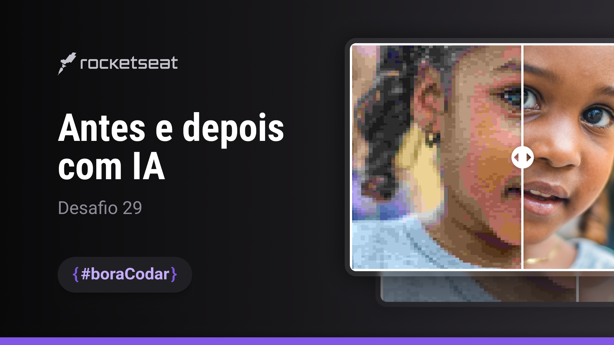

<!-- markdownlint-disable MD033 -->

# `Desafio #29 - Image AI Upscaler`

**Desafio da Semana**: Desenvolva um componente de antes e depois plataforma de melhoria de imagem com inteligência artificial. Use sua criatividade e fique à vontade para ir além.

> `#boraCodar` são desafios semanais promovido pela Rocketseat para ensino de tecnologias WEB.

  <a href="#-deploy">Deploy</a>&nbsp;&nbsp;&nbsp;&#124;&nbsp;&nbsp;&nbsp;
  <a href="#-tecnologias">Tecnologias</a>&nbsp;&nbsp;&nbsp;&#124;&nbsp;&nbsp;&nbsp;
  <a href="#-layout">Layout</a>&nbsp;&nbsp;&nbsp;&#124;&nbsp;&nbsp;&nbsp;
  <a href="#memo-licença">Licença</a>

 

  

## 🖥️ Deploy

Aprecie o resultado do desafio [`AQUI`](https://mgckaled.github.io/boracodar_desafios-rs/d29/template/).

## 🚀 Tecnologias

Esse projeto foi desenvolvido com as seguintes tecnologias:

- HTML, CSS e JS
- Git e Github
- Figma

## 🔖 Layout

Você pode visualizar o layout do projeto através [DESSE LINK](https://www.figma.com/community/file/1263495196524106760). É necessário ter conta no [Figma](https://figma.com) para acessá-lo.

## 📝 Licença

Esse projeto está sob a licença MIT. 

---

Feito com ♥ by Marcel Kaled 👋

> Voltar para a [lista de projetos](../README.md)
